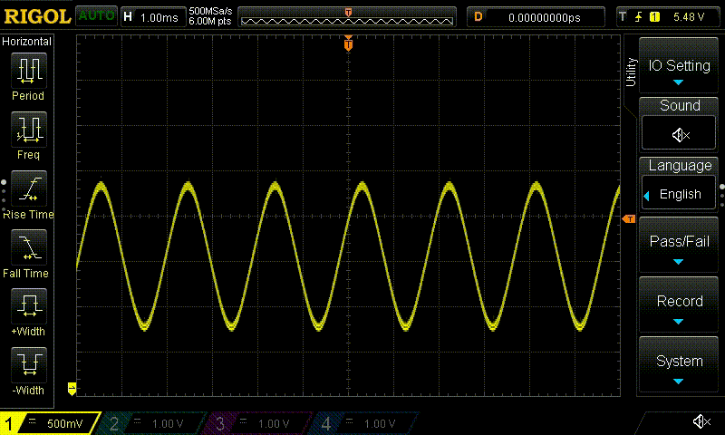
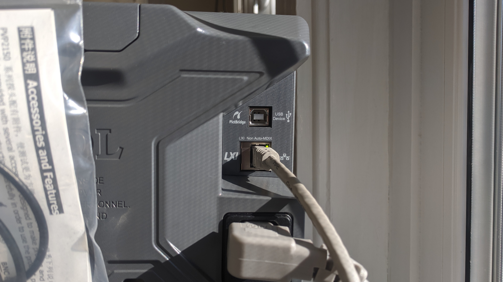
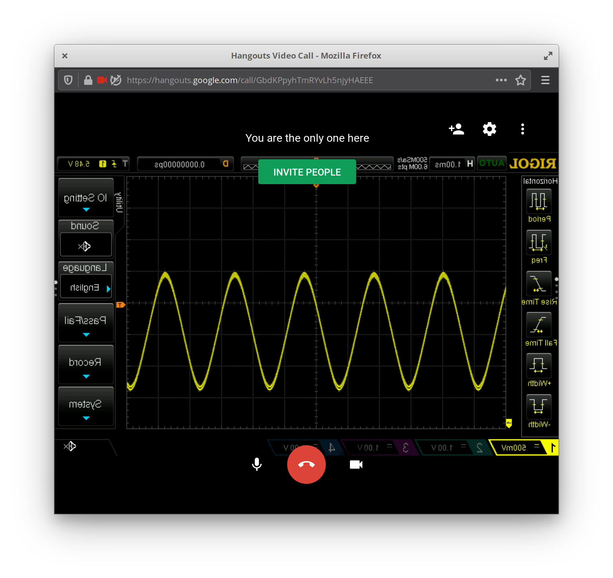
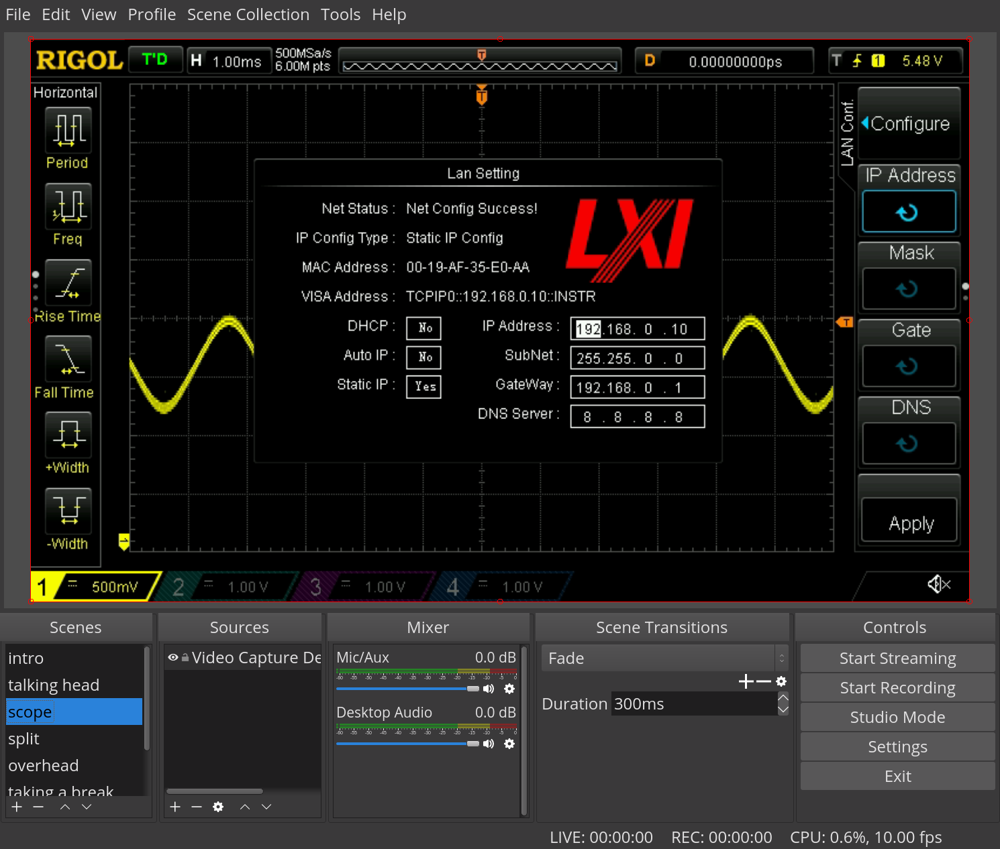

# Oscilloscope as webcam

Video-chat with your Oscilloscope. Seriously.



I own a [Rigol DS1054Z Oscilloscope](https://www.rigolna.com/products/digital-oscilloscopes/1000z/) and needed to capture the screen for a project.

I found articles from [theimpossiblecode](https://www.theimpossiblecode.com/blog/rigol-ds1054z-screen-capture-linux/) and [hackaday](https://hackaday.io/project/5807-driverless-rigol-ds1054z-screen-capture-over-lan#j-discussions-title) with instructions for capturing still images (screenshots) of the scope, but I need video!

## Setup

First connect the scope to your network with an ethernet cable.



Next enter the `Utility > IO Setting > LAN Conf.` menu and set a static ip address. For my network I choose `192.168.0.10`.


Check you can connect to the scope from your computer.

```
$ ping 192.168.0.10
```

Install the required software for your distribution.

```
$ sudo apt install v4l2loopback-dkms v4l2loopback-utils ffmpeg imagemagick
```

Finally, enable `v4l2loopback` and set the framerate.

```
$ sudo modprobe v4l2loopback
$ v4l2loopback-ctl set-fps 24 /dev/video1
```

## Usage

Ok, here's the good part. Run this command:

```
while true; do
    mogrify -format jpg | \
    echo ':display:data?' | \
    netcat -q 0 192.168.0.10 5555 | \
    tail -c +12 | \
    ffmpeg -re -i pipe: -f v4l2 -vcodec rawvideo -pix_fmt yuv420p /dev/video1
done
```

Here's what that does:

1. netcat establishes a tcp connection to the scope on port `5555`.
2. The message `:display:data?` is sent. This requests the current display data (screenshot) from the scope. The screenshot is returned as a bitmap with a 12 byte header.
3. The 12 byte header is removed removed.
4. The bmp image is piped to the `imagemagick` "mogrify" program to convert the bitmap to a `jpg`.
5. Finally the jpg frame is piped to ffmpeg that writes the frame to `/dev/video1`.
6. repeat.

Framerate? `netcat` is grabbing frames as fast as the scope can send them, but each frame is `1.2MB`! For 30fps video this would take `1.2M*30= 36MB/s = 288 mbps`! The ethernet port on this scope is 100mbps so the output video is limited to ~10 fps `1.2M*10= 12MB/s = 96 mbps` under perfect network conditions.

That said - if you're ok with 10 fps video. Good news! This device is recognized as a regular video device. You can treat it like a webcam! Usable with OBS, heck you can even video-chat with your O-scope.




